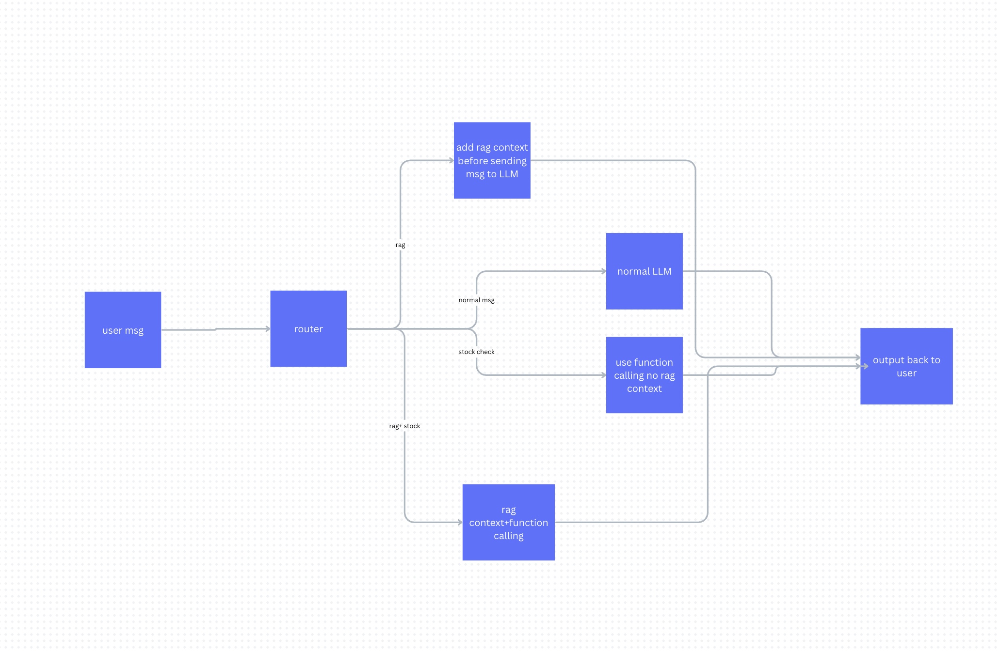

# langGraph Chatbot

A FastAPI-based AI agent powered by LangChain and LangGraph.  
It can answer questions from an NVIDIA PDF (RAG) **and** fetch live stock prices using custom tool functions.

---

## Features

- **RAG over PDF**: Perform semantic search and interact with an LLM to extract insights from your NVIDIA document.  
- **Text chat**: Communicate with the agent via REST API or a web-based UI.  
- **Audio chat**: Receive agent responses as TTS (Text-to-Speech) MP3 files.  
- **Stock prices**: Use the custom `get_price` function to fetch real-time stock quotes.  

---

## Quickstart

### 1. Clone the Repository

```bash
git clone https://github.com/your-org/langGraph-Chatbot.git
cd langGraph-Chatbot
```

### 2. Install Dependencies

```bash
pip install -r requirements.txt
```

### 3. Configure Environment

Update the `test.env` file with your configuration values.

### 4. Run the Server

Start the server using:

```bash
uvicorn app:app --reload
```

The server will be available at [http://127.0.0.1:8000](http://127.0.0.1:8000).

---

## Testing

### Web UI (Voice + Text)

1. Open `index.html` in your browser.  
2. Type or speak your query and receive responses in text or audio format.

### Terminal Chat (No Server Required)

Run the following command to chat directly in your terminal:

```bash
python terminalTest.py
```

---

## Workflow Overview

Here’s a basic workflow design:



Based on the user message, the router determines one of four options:

- **`rag`**: For extracting details from the NVIDIA 2024 Annual Report.  
- **`price`**: For fetching only the stock price.  
- **`both`**: For retrieving both report details and stock price.  
- **`chit_chat`**: For casual, off-topic conversations.

### Functionality Breakdown

1. **RAG Runner**: Adds context from the NVIDIA document to the user query before passing it to the LLM.  
2. **Stock Price Fetcher**: Provides real-time stock prices using custom functions.  used https://finazon.io/ for api

- For `rag` and `both` paths, RAG context is included in the query.  
- For `chit_chat`, no additional functions or context are used.  
- For `price`, only the stock price function is invoked without RAG context.